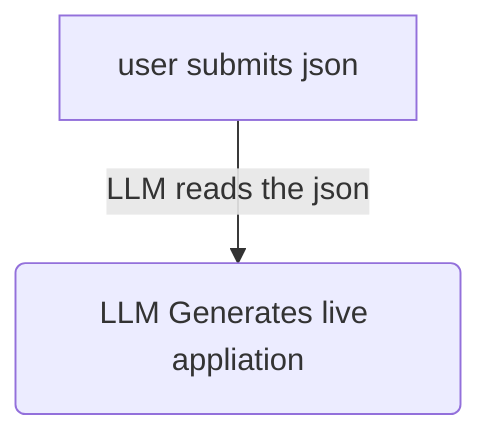

# Mini-App-Generator
A simple project based on generating an application, by providing relevant json format.

## Basic Flow

## TechStack:
Frontend : Nextjs
Backend : Express
Language : TypeScript
ORM : Prisma

## Getting Started
Frontend
```
cd client
npm run dev
```
Open http://localhost:3000 with your browser to see the result.

Backend
```
cd server
npm run start
```
