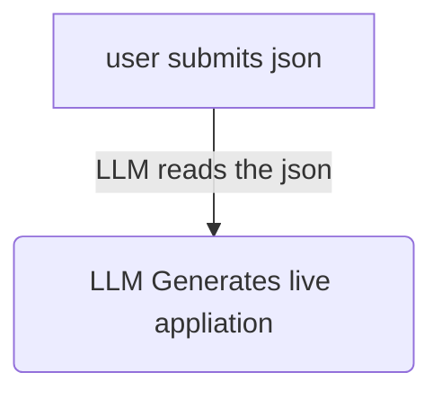

# Mini-App-Generator
This is a simple project based on generating an application, by providing relevant json format.

# Basic Flow

```mermaid
flowchart TD
    A[user submits json] --> |LLM reads the json| B(LLM Generates live appliation)
```
TechStack:
